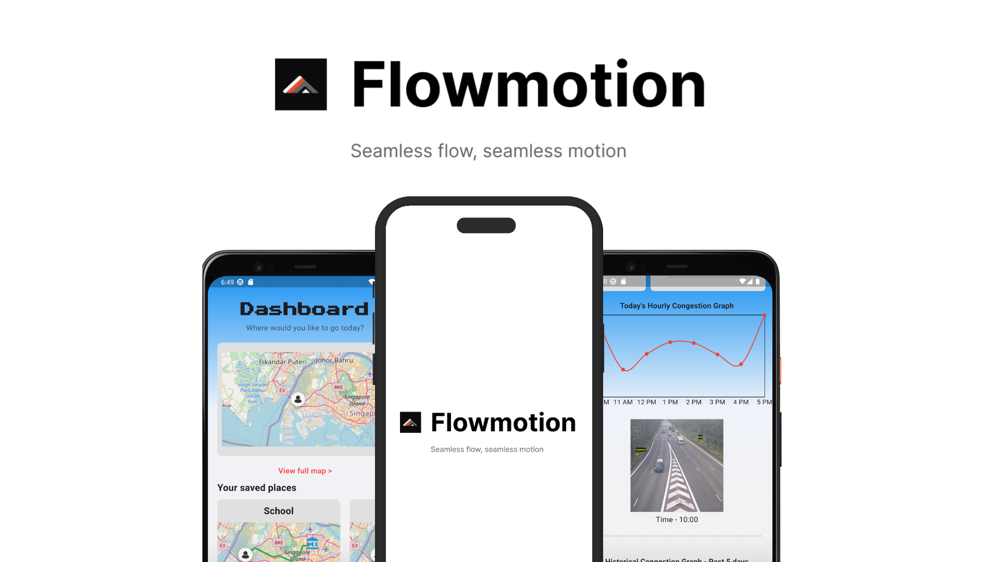
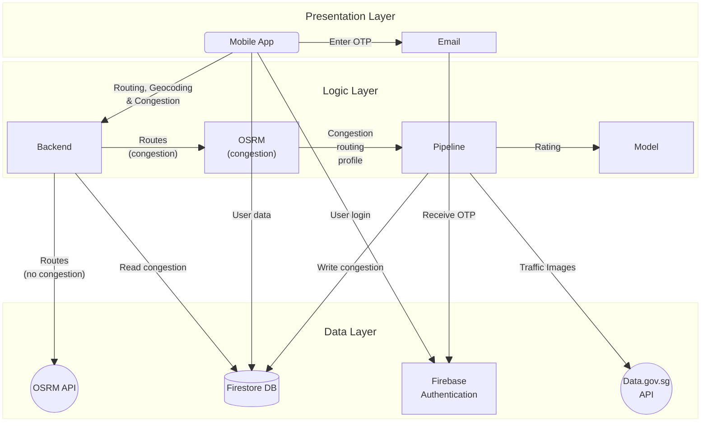

# Flowmotion
Real-time traffic congestion analysis and route optimization app for Singaporean drivers. Flowmotion uses computer vision to analyze traffic camera feeds for live traffic congestion rating and provide intelligent routing recommendations based on inferred congestion rating.

## Features

- 🚦 Real-time traffic congestion analysis using YOLOv8
- 🗺️ Intelligent route optimization with OSRM
- 📊 Historical traffic pattern visualization
- 📍 Favorite locations management
- 📱 Cross-platform mobile app (iOS & Android)

## Architecture



### Tech Stack

- **Frontend**: Flutter
- **Backend**: Express.js, Firebase
- **ML Pipeline**: YOLOv8, PyTorch
- **Infrastructure**: Google Cloud Run, Docker

## Getting Started

### Prerequisites

- Flutter >=3.24.1
- Node.js >=18
- Docker
- Firebase CLI

### Setup

1. Clone the repository

```bash
git clone https://github.com/flowmotion/flowmotion.git
cd flowmotion
```

2. Install dependencies

- Backend

````bash
# Backend
cd backend
npm install

- Mobile App
```bash
# Mobile
flutter pub get
````

- [Pipeline](pipeline/README.md)

3. Run Development builds

- Backend

```bash
# Run backend locally
cd backend
npm run dev
```

- Mobile App

```bash
# Run Flutter app
flutter run
```

- [Pipeline](pipeline/README.md)

## Performance

- Image Processing: ~124ms/image
- ML Model Accuracy: 80% (vehicles)
- Route Update Latency: &lt;332s

## Acknowledgments

- [data.gov.sg](https://data.gov.sg) for traffic camera feeds
- [OSRM](http://project-osrm.org/) for route optimization engine
- [YOLOv8](https://github.com/ultralytics/yolov8) for computer vision model
- Singapore Land Transport Authority for traffic data
